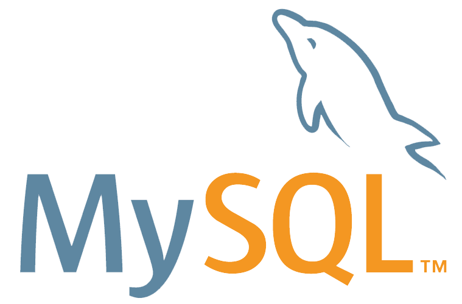

    

<h1 align="center">Development Resources</h1>

<i> A list of useful development resources . . . .</i>

 

## Table Of Contents :
- [Online Code Editors 💻](#online-code-editors)
- [Programming E-books 📗](#Programming-E-books)
- [Free Web Hosting Providers 💻](#Free-Web-Hosting-Providers)
- [Programming Websites & Blogs 📱](#Programming-Websites-&-Blogs)
- [Colors 🔴](#Colors)
- [Tools ⚙](#tools)
- [Icons](#Icons)
- [Fonts ✍](#Fonts)
- [UI / UX Inspirations ✏](#UI-/-UX-Inspirations)
- [Illustrations & Vectors ✏](#Illustrations-and-Vectors)
- [Photos 📲](#Photos)
- [Videos 🎥](#Videos)
- [Music & Sound 🎵](#Music-and-Sound)
- [Templates, Themes & Snippets 💻](#Templates-Themes-and-Snippets)
- [RoadMaps 🗺](#RoadMaps)
- [Learning Platforms 📙](#Learning-Platforms)
- [Youtube Programming Channels ](#Youtube-Programming-Channels)
- [Youtube Course Playlists 📼](#Youtube-Course-Playlists)
- [Telegram Channels & Groups ](#Telegram-Channels-and-Groups)
- [Competetive Programming 💻](#Competetive-Programming)
- [Articles ✏](#Articles)
- [Apps For Developers 📱](#Apps-For-Developers)
- [Facebook Groups & pages ](#Facebook-Groups-and-pages)

### Online Code Editors:

- [Codepen](https://codepen.io/) - 

    - Frameworks
        - [React](https://codepen.io/topic/react/templates)
        - [Vue](https://codepen.io/topic/vue/templates)
        - [Flutter](https://codepen.io/topic/flutter/templates)
        - [Pug](https://codepen.io/topic/pug/templates)
        - [D3.js](https://codepen.io/topic/d3/templates)
        - [TensorFlow.js](https://codepen.io/topic/tensorflow/templates)
        - [ZIM](https://codepen.io/topic/zim/templates)

    - Libraries
        - [GSAP](https://codepen.io/topic/gsap/templates)
        - [Zdog](https://codepen.io/topic/zdog/templates)
        - [Tailwind CSS](https://codepen.io/topic/tailwind/picks)
        - [Anime.js](https://codepen.io/topic/anime/picks)
        - [Splitting.js](https://codepen.io/topic/splitting/templates)

    - [UI Patterns](https://codepen.io/topics/ui-patterns)

- [Codesandbox](https://codesandbox.io/)

    - Frameworks
        - React
        - Vue
        - Angular

    - UI Frameworks
    - Component Libraries
    - Web App & API Starters
    - Databases
    - Visualization
    - Ecommerce
    - Blogging

- [JSFiddle](https://jsfiddle.net/)
    - HTML
    - CSS
    - Javascript

- [Stackblitz](https://stackblitz.com/)
    - Angular
    - React
    - Ionic
    - TypeScript
    - RxJS
    - Svelte
    - Angular.js
    - Javascript
    - Ignite UI
    - KendoReact

- [PlayCode](http://playcode.io/)
    - React.js
    - Vue
    - Pixi.js
    - Canvas
    - Three.js
    - JSON
    - Image

### Programming E-books: 

- [OpenLibrary](openlibrary.org)
- [Archieve](archive.org)
- [PDFDrive](pdfdrive.com)
- [GutenBerg](gutenberg.org)
- [BookFlare](bookflare.net)
- [TodayDownloadz](www.todaydownloadz.com)
- [All E-books](https://all-ebook.info)

### Free Web Hosting Providers: 

- [wordpress](https://wordpress.com/)
- [Wix](https://www.wix.com/)
- [InfintyFree](https://infinityfree.net/)	
- [AwardSpace](https://www.awardspace.com/)	
- [UhostFull](https://www.uhostfull.com/)	
- [000Webhosting](https://www.000webhost.com/)
- [Netlify](https://www.netlify.com/)
- [Github Pages](https://pages.github.com/)
- [Gatsby.js](https://www.gatsbyjs.com/)

### Programming Websites & Blogs:

- [Medium](https://medium.com/)
- [Morioh](https://morioh.com/)
- [Techgig](https://www.techgig.com/)
- [Codrops](https://tympanus.net/codrops/)
- [Daily.Dev](https://daily.dev/)
- [prototypr](https://prototypr.io/home/)
- [Speckyboy](https://speckyboy.com/)
- [sitePoint](https://www.sitepoint.com/)
- [css-Tricks](https://css-tricks.com/)
- [A List Apart](https://alistapart.com/)
- [Tutorial Zine](https://tutorialzine.com/)
- [Smashing Magazine](https://www.smashingmagazine.com/)
- [Web Designer Depot](https://www.webdesignerdepot.com/)
- [Dev.to](https://dev.to/)
- [The Crazy Programmer](https://www.thecrazyprogrammer.com/)
- [Stack Abuse](https://stackabuse.com/)
- [Coding Alpha](https://www.codingalpha.com/)
- [Reddit Programming](https://www.reddit.com/r/programming/)
- [CodeWall](https://www.codewall.co.uk/)
- [Tuts PLanet](https://www.tutsplanet.com/)
- [CodingHorror](https://blog.codinghorror.com/)
- [DWB](https://davidwalsh.name/)
- [Web Dev BLog](https://webdevblog.com/)
- [RayWenderLich](https://www.raywenderlich.com/)

### Colors: 

- [Material Palette](https://www.materialpalette.com/)
- [New Flat UI Color Picker](http://www.flatuicolorpicker.com/)
- [Flat UI Colors](https://flatuicolors.com/)
- [Flat Colors UI](http://www.flatcolorsui.com/)
- [Coolors](https://coolors.co/)
- [Material UI Colors](https://www.materialui.co/flatuicolors)
- [Colorful Gradients](https://colorfulgradients.tumblr.com/)
- [Adaptive Backgrounds](https://github.com/benhowdle89/Adaptive-Backgrounds)
- [Brand Colors](https://brandcolors.net/)
- [Paletton](https://paletton.com/)
- [Colour Lovers](https://www.colourlovers.com/)
- [Adobe Color CC](https://color.adobe.com/create/color-wheel)
- [Bootflat](https://bootflat.github.io/color-picker.html)
- [Hex Colorrrs](https://www.webfx.com/web-design/hex-to-rgb/)
- [Get UI Colors](http://getuicolors.com/)
- [Coleure](https://www.webfx.com/web-design/color-picker/)
- [Colllor](http://colllor.com/)
- [UI gradients](https://uigradients.com/#ALostMemory)
- [color scheme designer](https://colorschemedesigner.com/csd-3.5/)
- [Coolors](https://coolors.co/)
- [Adobe Color CC](https://color.adobe.com/create/color-wheel)
- [Color Thoery](https://tallys.github.io/color-theory/)
- [ColorHunt](https://colorhunt.co/)
- [Bada55](http://bada55.io/)
- [ColorDesigner.io](https://colordesigner.io/)
- [ColorMind](http://colormind.io/bootstrap/)
- [Learn UI](https://learnui.design/tools/data-color-picker.html)
- [ImageColors](https://image-color.com/)
- [LOL Colors](https://www.webdesignrankings.com/resources/lolcolors/)
- [Material Palette](https://www.materialpalette.com/)
- [shapeFactory](https://pigment.shapefactory.co/)
- [Palettable.io](https://www.palettable.io/ED3E75-383838-D4D4D4)
- [Paletton](http://paletton.com/#uid=1000u0kllllaFw0g0qFqFg0w0aF)
- [CSS Gradient](https://cssgradient.io/gradient-backgrounds/)
- [Picular](https://picular.co/)

### Tools:

- React  : 
    - [Awesome React](https://github.com/enaqx/awesome-react)
    - [Absolutely Awesome React Components & Libraries](https://github.com/brillout/awesome-react-components)
    - [awesome react native](https://github.com/jondot/awesome-react-native)
    - [Awesome React](https://awesomereact.com/)
    - [Awesome React](https://github.com/gaearon/awesome-react)

- Python  : 
    - [Awesome Python](https://github.com/vinta/awesome-python)
    - [Fucking Awesome Python](https://github.com/trananhkma/fucking-awesome-python)

- MY Sql  : 
    - [awesome-mysql](https://github.com/shlomi-noach/awesome-mysql)
    - [Awesome MySQL Queries and Commands](https://github.com/joseluisq/awesome-mysql-queries-commands)

- Java  : 
    - [Awesome Java](https://github.com/akullpp/awesome-java)
    - [Awesome Java](https://github.com/pditommaso/awesome-java)
    - [Awesome Java](https://github.com/wtsxDev/Amazing-Java-List)
    - [10 excellent GitHub repositories for Java developer](https://towardsdatascience.com/10-excellent-github-repositories-for-every-java-developer-41084a91ade9)
    - [Top Github repositories for Java developers](https://dev.to/ama/top-github-repositories-for-java-developers-4bh2)

- Android  : 
    - [android-samples](https://github.com/kevalpatel2106/android-samples)
    - [List of Android UI/UX Libraries](https://github.com/wasabeef/awesome-android-ui)
    - [Awesome Android](https://github.com/JStumpp/awesome-android)
    - [List of Android UI Libraries](https://github.com/thanhtoan1196/awesome-android-ui)
    - [Awesome Android Libraries — 2018 October — December Android Developer Library GitHub](https://medium.com/@PongPloyAppDev/xxx-top-awesome-android-libraries-2018-october-december-android-developer-library-github-74082be6d777)

- Hacking : 
  - 
<b>Note : All this resources are provided for educational purpose's.</b>

    - [Awesome Hacking](https://github.com/Hack-with-Github/Awesome-Hacking)
    - [Awesome Hacking -An Amazing Project](https://github.com/carpedm20/awesome-hacking)
    - [The Top 450 Hacking Open Source Projects](https://awesomeopensource.com/projects/hacking)
    - [Awesome Hacking Resources](https://github.com/vitalysim/Awesome-Hacking-Resources)
    - [100 HACKING TOOLS AND RESOURCES](https://www.hackerone.com/blog/100-hacking-tools-and-resources)

    - search Engines : 
    - [Shodan](https://www.shodan.io/)
    - [Censys](https://censys.io/ipv4)
    - [Onyphe](https://www.onyphe.io/)
    - [hunter](https://hunter.io/)
    - [Wigle](https://wigle.net/)

    - learning Resources : 
        - [SecurityTube](http://www.securitytube.net/)
        - [Amanhardikar](https://amanhardikar.com/)
        - [Seed security labs](https://seedsecuritylabs.org/)
        - [Backdoor.sdslabs](https://backdoor.sdslabs.co/)
        - [Hacksplaining](https://www.hacksplaining.com/)
        - [Hack The Box](https://www.hackthebox.eu/)
        - [Enigma Group](https://www.enigmagroup.org/)
        - [Pwnable.kr](http://pwnable.kr/)
        - [Pwnable.tw](https://pwnable.tw/)
        - [Hacking Articles](https://www.hackingarticles.in/)
        - [Corelan.be](https://www.corelan.be/)
        - [Recon.cx](https://recon.cx/)
        - [Payatu](https://payatu.com/)
        - [Exploit DB](https://www.exploit-db.com/)
        - [From Dev](https://www.fromdev.com/)
        - [CompariTech](https://www.comparitech.com/)
        - [EC Council](https://www.eccouncil.org/)
        - [Sec Tools](https://sectools.org/)

- PHP  : 
    - [Awesome PHP](https://github.com/ziadoz/awesome-php)
    - [awesome-php](https://github.com/uhub/awesome-php)
    - [50 Most Popular PHP Projects on GitHub](https://medium.com/issuehunt/50-most-popular-php-projects-on-github-c8cf6a242eb9)
    - [List of Best Awesome Php Libraries](https://www.ma-no.org/en/programming/php/php-list-of-best-awesome-php-libraries)
    - [The Top 88 Php Library Open Source Projects](https://awesomeopensource.com/projects/php-library)
    - [My Awesome PHP List](http://wiki.travisfont.com/My_Awesome_PHP_List)

- vue.js  :
    - [Awesome Vuetify](https://github.com/vuetifyjs/awesome-vuetify)
    - [10 Resources to Learn Vue.js in 2020](https://medium.com/better-programming/10-resources-to-learn-vue-js-in-2020-c596e070772)
    - [Vuex made simple — getting started!](https://itnext.io/vuex-made-simple-getting-started-6bf229d432cf)
    - [Top 7 Vue.js Projects on GitHub](https://medium.com/javascript-in-plain-english/top-7-vue-js-projects-on-github-19ba006d34e8)
    - [Creating Components in VueJS](https://medium.com/javascript-in-plain-english/creating-components-in-vuejs-c7a61d84430c)

    - Component Libraries : 
        - [Element UI](https://element.eleme.cn/#/en-US)
        - [Vuetify](https://vuetifyjs.com/en/)
        - [Bootstrap Vue](https://bootstrap-vue.org/)
        - [Buefy](https://buefy.org/#/)
        - [Vue Material](https://vuematerial.io/)
        - [Quasar](https://quasar.dev/)
        - [Vux](https://github.com/airyland/vux)
        - [iView](http://iview.talkingdata.com/)
        - [Vue Material Kit](https://github.com/creativetimofficial/vue-material-kit)
        - [Mint UI](http://mint-ui.github.io/)
        - [Fish UI](https://github.com/myliang/fish-ui)
        - [Keen UI](https://josephuspaye.github.io/Keen-UI/#/ui-alert)
        - [AT-UI](https://github.com/at-ui/at-ui)
        - [Vuepress](https://github.com/vuejs/vuepress)
        - [Eagle UI](https://zulko.github.io/eaglejs-demo/)

- Flutter  : 
    - [Flutter Studio](https://flutterstudio.app/)
    - [Flutter Awesome List](https://github.com/sunilkumarvalmiki/awesome-flutter)
    - [panache](https://rxlabz.github.io/panache/#/)
    - [Code Magic](https://codemagic.io/start/)
    - [Appetize](https://appetize.io/)
    - [TestMagic](https://testmagic.io/)
    - [ScreenShots](https://github.com/mmcc007/screenshots)
    - [Supernova](https://www.supernova.io/)
    - [Pb.Dev](https://pub.dev/)
    - [Vysor](https://www.vysor.io/)
    - [Rive App](https://rive.app/)
    - [FLutter Bloc](https://github.com/felangel/bloc)
    - [Flutter Official](https://github.com/flutter/flutter)
    - [Flutter UI Templates](https://github.com/mitesh77/Best-Flutter-UI-Templates)
    - [Flutter Firebase](https://github.com/FirebaseExtended/flutterfire)
    - [Flutter Examples By App Brewery](https://github.com/londonappbrewery/Clima-Flutter)
    - [Flutter Examples By FilledStacks](https://github.com/FilledStacks/flutter-tutorials)
    - [Flutter UI Challenges](https://github.com/lohanidamodar/flutter_ui_challenges)
    - [Flutter Screens](https://github.com/samarthagarwal/FlutterScreens)
    - [Flutlab.io](https://flutlab.io/)
    - [CodeAppRun.io](https://codeapprun.io/)
    - [DartPad](https://dartpad.dev/)
    - [Flutter App Builder](https://flutterappbuilder.club/)
    - [Flutter Awesome](https://flutterawesome.com/)
    - [Code With Andrea](https://codewithandrea.com/)
    - [Flutter Material Design](https://material.io/develop/flutter)
    - [itsAllWidgets](https://itsallwidgets.com/)
    - [XD to Flutter Plugin: Convert XD Designs into Working Code to Build Native Apps with Google’s Flutter](https://blog.adobe.com/en/2019/12/11/xd-flutter-plugin-generate-dart-code-design-elements.html#gs.fvqmpa)

- Javascript  : 
    - [OverAPI](https://overapi.com/javascript)
    - [Mastering JS](https://masteringjs.io/)
    - [Awesome Javascript Learning](https://github.com/micromata/awesome-javascript-learning)
    - [Javascript Learning Resource](https://github.com/CodementorIO/JavaScript-Learning-Resources)
    - [Awesome Javascript](https://github.com/sorrycc/awesome-javascript)

- Web Development : 
    - [Awesome Web Development Resources](https://github.com/mrmartineau/awesome-web-dev-resources)
    - [Web Development Resources](https://github.com/MilanAryal/web-development-resources)
    - [FrontEnd Developer Resources](https://github.com/RitikPatni/Front-End-Web-Development-Resources)
    - [Awesome Stars](https://github.com/taielab/awesome-hacking-lists)

- Mobile Development : 
    - [Awesome-Fuse](https://github.com/fuse-compound/awesome-fuse)

- CSS :
    - [CSS Matic](https://www.cssmatic.com/) - CSS Customization Tool
    - [Neumorphism](https://neumorphism.io/) - neuromorphic CSS generator
    - [Neuromorphic.Design](https://neumorphic.design/) - Neuromorphic CSS generator
    - [Soft UI](https://www.softui.io/) - Neuromorphic CSS generator
    - [CSSfx](https://cssfx.netlify.app/) - CSS effects
    - [Cubic Beizer](https://cubic-bezier.com/#.17,.67,.83,.67) - Cubic Beizer functions
    - [Shape Divider](https://www.shapedivider.app/) - Custom CSS Shapes
    - [CSS MiniFier](https://cssminifier.com/) - CSS minifier
    - [Auto Pefixer](https://autoprefixer.github.io/) - CSS AutoPrefixer
    - [CSS Grid Generator](https://cssgrid-generator.netlify.app/) - css grid generator
    - [Stickybits](https://dollarshaveclub.github.io/stickybits/) - css position polyfill

- [CheatSheet](https://github.com/logeshpaul/Frontend-Cheat-Sheets) - A List of Programming Cheatsheets
- [Free For Dev](https://github.com/ripienaar/free-for-dev) - A list of Free Resources for Developers 
- [Map Style](https://mapstyle.withgoogle.com/) - Google Maps Customization Tool
- [Snazzy Maps](https://snazzymaps.com/) - Maps Customization Tool
- [Can i use](https://caniuse.com/) - Broswer support
- [HTML5 Test](https://html5test.com/) - Browser support
- [Uglify](https://skalman.github.io/UglifyJS-online/) - JS Minifier
- [Javascript Compressor](http://javascriptcompressor.com/) - JS Compressor
- [Multi.js](https://fabianlindfors.se/multijs/) - select box Custimization Library
- [JSON Formatter](https://jsonformatter.curiousconcept.com/) - json validator
- [Fake JSON](https://fakejson.com/) - fake json generator
- [Resume Nation](https://resume-nation.github.io/) - Resume Builder
- [FollowUp Then](https://www.followupthen.com/) - email remainder
- [Edubirdie](https://edubirdie.com/plagiarism-checker) - phlagarism checker
- [Postify](https://postfity.com/) - post schdeluer
- [RollApp](https://www.rollapp.com/) - file opener
- [PWABuilder](https://www.pwabuilder.com/) - PWA builder
- [DataFlowKit](https://dataflowkit.com/dfk) - web scraping
- [Glide](https://www.glideapps.com/) - app creator from google Sheets
- [Carbon](https://carbon.now.sh/) - Create Beautiful code Snippets 
- [App Diagrams](https://app.diagrams.net/) - uml,flowchart drawing tool
- [React Toolbox](http://react-toolbox.io/#/) - React tools
- [POstal HQ](https://github.com/postalhq/postal) - free mail web server
- [Reat SKetch App](http://airbnb.io/react-sketchapp/) - react sketch app
- [FIgma](https://www.figma.com/) - figma ui designer
- [Kur DeepLearning](https://github.com/deepgram/kur) - kur deeplearning
- [MailDrop](https://maildrop.cc/) - mailbox security
- [Sizzy](https://sizzy.co/) - responsive design
- [Probot](https://probot.github.io/docs/) - bot App builder
- [SpellRun](https://spell.run/) - spell checker
- [SafeCopy](http://safecopy.sourceforge.net/) - data exraction tool
- [PhotoPea](https://www.photopea.com/) - photoshop
- [Logo Makr](https://logomakr.com/) - logo maker
- [Flaming Text](https://www.flamingtext.com/) - Fonts & Logo Maker
- [LeanLogoMaker](https://leanlogomaker.com/) - Logo maker
- [Online Logo Maker](https://www.onlinelogomaker.com/) - logo maker
- [screenzy](https://screenzy.io/) - screenshot
- [Tiny PNG](https://tinypng.com/) - png compressor						
- [ezGIF](https://ezgif.com/) - gif
- [Burner Bonanza](https://burner.bonanza.com/) - background eraser
- [Copy Paste Character](https://www.copypastecharacter.com/) - special character generator
- [Zxing AppSpot](https://zxing.appspot.com/generator/) - QR code generator
- [Favicon Generator](https://www.favicon-generator.org/) - favicon generator
- [Favicon Generator](https://realfavicongenerator.net/) - favicon generator
- [Favicon Generator](https://favicon.io/) - favicon generator
- [Favicon Generator](https://www.favicongenerator.com/) - favicon generator
- [Web Developer Checklist](https://www.toptal.com/developers/webdevchecklist) - A Curated Checklist for Web Developers
- [Responsinator](http://www.responsinator.com/) - Responsive Design in Different Devices
- [Responsive Grid System](http://www.responsivegridsystem.com/) - Responsive Grid System
- [Compressor](https://compressor.io/) - images optimizer
- [Optimizilla](https://imagecompressor.com/) - images optimizer
- [Draw.io](https://app.diagrams.net/) -  used for drawing flowcharts,diagrams,org charts, UML, ER and network diagrams.
- [UnMinify](https://unminify.com/) - To UnMinify HTML,CSS,JS 
- [WebCode Tools](https://webcode.tools/) - CSS3, HTML5, Microdata, Open Graph and Twitter Card Generators
- [PDF Candy](https://pdfcandy.com/) - All-in-one PDF Tool 
- [Dev Hints](https://devhints.io/)- Cheatsheets for programming languages
- [Modern Javascript CheatSheet](https://github.com/mbeaudru/modern-js-cheatsheet) - Modern javascript Cheatsheet 

### Icons:

- [IcoMoon](https://icomoon.io/)
- [Font Awesome](https://fontawesome.com/)
- [IconMonster](https://iconmonstr.com/)
- [Icons8](https://icons8.com/)
- [Fontello](http://fontello.com/)
- [Noun Project](https://thenounproject.com/)
- [Flat Icon](https://flaticons.net/)
- [Flaticons](https://www.flaticon.com/)
- [Material Design Icons](https://material.io/resources/icons/?style=baseline)
- [Glyphsearch](https://glyphsearch.com/)
- [Endless Icons](http://endlessicons.com/)
- [Perfect Icons](http://www.perfect-icons.com/)
- [Free Round Icons](https://roundicons.com/)
- [Icon Sweets](https://designbombs.com/iconsweets2/)
- [StreamLine](https://www.streamlineicons.com/)
- [FreePik](https://www.freepik.com/)
- [IconsSVG](https://iconsvg.xyz/)
- [Simple Icons](https://simpleicons.org/)
- [React Icons](https://react-icons.github.io/react-icons/#/)
- [Evil Icons](https://evil-icons.io/)
- [SVGPorn](https://svgporn.com/)
- [Feather Icons](https://feathericons.com/)
- [System UI Icons](https://systemuicons.com/)
- [BrandIcons](http://fontello.github.io/brandico.font/demo.html)
- [glyhs](https://www.webhostinghub.com/glyphs/)
- [IconGram](https://icongr.am/)
- [Ionicons](https://ionicons.com/)
- [Map Icons](http://map-icons.com/)
- [Material & Ionic Icons](http://zavoloklom.github.io/material-design-iconic-font/icons.html)
- [MFG Labs](http://mfglabs.github.io/mfglabs-iconset/)
- [MICons](http://xtoolkit.github.io/Micon/)
- [Octicons](https://primer.style/octicons/)
- [Useiconic](https://useiconic.com/open/)
- [OpenWeb Icons](https://pfefferle.dev/openwebicons/)
- [Shapes.so](https://shape.so/)
- [StackIcons](http://stackicons.com/)
- [Weather Icons](https://erikflowers.github.io/weather-icons/)
- [Social Button Icons](https://smcllns.github.io/css-social-buttons/)

### Fonts:  

- [google fonts](https://fonts.google.com/)
- [font squirrel](https://www.fontsquirrel.com/)
- [font space](https://www.fontspace.com/)
- [dafont](https://www.dafont.com/)
- [abstract fonts](http://www.abstractfonts.com/)
- [1001 fonts](https://www.1001fonts.com/)
- [urban fonts](https://www.urbanfonts.com/)
- [free typography](https://freetypography.com/)
- [fonts.lol](http://fonts.lol/)
- [freshfonts.io](http://freshfonts.io/)
- [fontsarena](https://fontsarena.com/)
- [fontspark](https://fontspark.app/)

### UI / UX Inspirations:

- [dribble](https://dribbble.com/)
- [behance](https://www.behance.net/)
- [pinterest](https://in.pinterest.com/)
- [awwwards](https://www.awwwards.com/)
- [deviant art](https://www.deviantart.com/)
- [adduzeedo](https://abduzeedo.com/)
- [designspiration](https://www.designspiration.com/)
- [muzli design inspiration](https://www.designspiration.com/)
- [site inspire](https://www.siteinspire.com/?orgin=pi001.com)
- [booooooom](https://www.booooooom.com/)

### Illustrations and Vectors: 

- [StockSnap](https://stocksnap.com/)
- [freepik](https://www.freepik.com/vectors)
- [vecteezy](https://www.vecteezy.com/)
- [Drawkit](https://www.drawkit.io/)
- [vectorStock](https://www.vectorstock.com/)
- [humaaans](https://www.humaaans.com/?ref=blogduwebdesign.com)
- [vector.me](https://vector.me/)
- [vector portal](https://vector.me/)
- [undraw](https://undraw.co/illustrations)

#### Photos:

- [Freepik](https://www.freepik.com/)
- [pexels](https://www.pexels.com/)
- [unsplash](https://unsplash.com/)
- [pixabay](https://pixabay.com/)
- [picjumbo](https://picjumbo.com/)
- [stockio](https://www.stockio.com/)
- [stock vault](https://www.stockvault.net/)
- [free range](https://freerangestock.com/)
- [Burst.Shopify](https://burst.shopify.com/)
- [FoodiesFeed](https://www.foodiesfeed.com/)
- [Gratisography](https://gratisography.com/)
- [PIcography](https://picography.co/)

### Videos: 

- [pexels](https://www.pexels.com/)
- [pixabay](https://pixabay.com/)
- [videvo](https://www.videvo.net/)
- [life of vids](https://www.lifeofvids.com/)
- [split shire](https://www.splitshire.com/)
- [distill](https://www.wedistill.io/)
- [dareful](https://www.dareful.com/)
- [videezy](https://www.videezy.com/)
- [vidsplay](https://www.vidsplay.com/)

### Music and Sound: 

- [Freeplay music](https://freeplaymusic.com/)
- [FMA](https://freemusicarchive.org/)
- [Audio nautix](https://audionautix.com/)
- [Pacdv](https://www.pacdv.com/sounds/)
- [BenSound](https://www.bensound.com/)
- [Audio Blocks](https://www.storyblocks.com/audio/collections/creator-to-creator)
- [Tekno AXE](http://teknoaxe.com/Home.php)

### Templates Themes and Snippets:

- [HTML5up](https://html5up.net/)
- [BootstrapStrater](https://bootstrapstarter.com/)
- [StartBootstrap](https://startbootstrap.com/)
- [MDBootstrap](https://mdbootstrap.com/)
- [Html5 Slides Library](https://www.jssor.com/)
- [Free Frontend](https://freefrontend.com/)
- [Bootsnip](https://bootsnipp.com/)
- [Wow Slider](https://wowslider.com/)
- [CodemyUI](https://codemyui.com/)
- [CodyHouse](https://codyhouse.co/)
- [NavNav](http://navnav.co/)
- [Styled-Components](https://styled-components.com/)
- [Web Dev Tricks](https://webdevtrick.com/)

### RoadMaps: 

- [Frontend](https://roadmap.sh/frontend) - [Article](https://levelup.gitconnected.com/the-2020-web-developer-roadmap-76503ddfb327)
- [Backend](https://roadmap.sh/backend)- [Article](https://levelup.gitconnected.com/the-2020-web-developer-roadmap-76503ddfb327)
- [React ](https://roadmap.sh/react) - [Article](https://javarevisited.blogspot.com/2018/10/the-2018-react-developer-roadmap.html)
- [React New ](https://hackernoon.com/the-2020-reactjs-developer-roadmap-8q143yan) - [Article](https://hackernoon.com/the-2020-reactjs-developer-roadmap-8q143yan)
- [Android ](https://roadmap.sh/android) - [Article](https://github.com/MindorksOpenSource/android-developer-roadmap)
- [Andriod 2020 ](https://medium.com/mindorks/android-development-learning-path-2020-edition-3f464ac56dbf) - [Article](https://medium.com/mindorks/android-development-learning-path-2020-edition-3f464ac56dbf)
- [Devops](https://roadmap.sh/devops)- [Article](https://levelup.gitconnected.com/the-2020-web-developer-roadmap-76503ddfb327)
- [Full-Stack Web Developer 2020](https://medium.com/codingthesmartway-com-blog/the-2020-roadmap-to-fullstack-web-development-6d1713697a27) - [Article](https://medium.com/codingthesmartway-com-blog/the-2020-roadmap-to-fullstack-web-development-6d1713697a27)
- [Modern Javascript Learning path 2020  ](https://javascript.info/) - [Article](https://www.youtube.com/watch?v=gSnbnYffz7k)
- [PHP ](https://github.com/odan/learn-php) - [Article](https://github.com/odan/learn-php)
- [Java ](https://javarevisited.blogspot.com/2019/10/the-java-developer-roadmap.html) - [Article](https://javarevisited.blogspot.com/2019/10/the-java-developer-roadmap.html)
- [Java ](https://www.decipherzone.com/blog-detail/roadmap-java-developers-2020) - [Article](https://www.decipherzone.com/blog-detail/roadmap-java-developers-2020)
- [Python ](https://medium.com/edureka/how-to-become-a-python-developer-462a0093f246) - [Article](https://medium.com/edureka/how-to-become-a-python-developer-462a0093f246)
- [Python ](https://hackernoon.com/a-realistic-roadmap-to-becoming-a-python-developer-ab5872959509) - [Article](https://hackernoon.com/a-realistic-roadmap-to-becoming-a-python-developer-ab5872959509)
- [DataScience ](https://medium.com/@ArtisOne/data-science-roadmap-2020-b256fb948404) - [Article](https://medium.com/@ArtisOne/data-science-roadmap-2020-b256fb948404)
- [Flutter ](https://github.com/DroidsOnRoids/flutter-roadmap) - [Article](https://github.com/DroidsOnRoids/flutter-roadmap)
- [Flutter New ](https://github.com/olexale/flutter_roadmap) - [Article](https://github.com/olexale/flutter_roadmap)
- [Flutter 2020 ](https://medium.com/flutterdevs/roadmap-to-become-a-flutter-developer-resources-for-beginners-ccb68718c84b) - [Article](https://medium.com/flutterdevs/roadmap-to-become-a-flutter-developer-resources-for-beginners-ccb68718c84b)
- [Vue.js developer 2020 ](https://flaviocopes.com/vue-developer-roadmap/) - [Article](https://flaviocopes.com/vue-developer-roadmap/)
- [Vue Hero’s roadmap ](https://medium.com/@steinovehelset/vue-heros-roadmap-to-learn-vue-js-2ac83e48396e) - [Article](https://medium.com/@steinovehelset/vue-heros-roadmap-to-learn-vue-js-2ac83e48396e)
- [Hacker Roadmap ](https://github.com/sundowndev/hacker-roadmap) - [Article](https://github.com/sundowndev/hacker-roadmap)
- [A Beginner’s Road Map on Ethical Hacking ](https://medium.com/@abhiii/a-beginners-road-map-on-ethical-hacking-8aa83f01dbd1) - [Article](https://medium.com/@abhiii/a-beginners-road-map-on-ethical-hacking-8aa83f01dbd1)
- [A UX Design Road Map For Starters ](https://medium.com/we-are-orb/a-ux-design-road-map-for-starters-c8505c30587d) -
[Article](https://medium.com/we-are-orb/a-ux-design-road-map-for-starters-c8505c30587d)
- [Ui Ux Designer Roadmap ](https://awesomeopensource.com/project/togiberlin/ui-ux-designer-roadmap) - [Article](https://awesomeopensource.com/project/togiberlin/ui-ux-designer-roadmap)
- [Game Developer Roadmap 2020 ](https://github.com/utilForever/game-developer-roadmap) - [Article](https://github.com/utilForever/game-developer-roadmap)
- [Game Development — A Personal Roadmap ](https://medium.com/@ozgurcakmak/game-development-a-personal-roadmap-b6354058f44f) - [Article](https://medium.com/@ozgurcakmak/game-development-a-personal-roadmap-b6354058f44f)
- [Machine Learning (ML) 2020](https://github.com/JsonChao/ML-Roadmap) - [Article](https://github.com/JsonChao/ML-Roadmap)
- [Machine Learning (ML) Engineering 2020](https://github.com/chris-chris/ml-engineer-roadmap) - [Article](https://github.com/chris-chris/ml-engineer-roadmap)
- [Machine Learning path](https://medium.com/machine-learning-world/learning-path-for-machine-learning-engineer-a7d5dc9de4a4) - [Article](https://medium.com/machine-learning-world/learning-path-for-machine-learning-engineer-a7d5dc9de4a4)

### Learning Platforms: 

- [Udemy](https://www.udemy.com/)
- [Udacity](https://www.udacity.com/)
- [edx](https://www.edx.org/)
- [codeacademy](https://www.codecademy.com/)
- [learn-c.org](https://www.learn-c.org/)
- [programiz](https://www.programiz.com/)
- [hackr.io](https://hackr.io/)
- [coursera](https://www.coursera.org/)
- [khan acamdey](https://www.khanacademy.org/)
- [academic earth](https://academicearth.org/)
- [Alison](https://alison.com/)
- [lesson paths](https://www.lessonpaths.com/)
- [pluralsight](https://www.pluralsight.com/)
- [sololearn](https://www.sololearn.com/)
- [MIT Open Courseware](https://ocw.mit.edu/)
- [Scotch.io](https://scotch.io/)
- [Scrimba](https://scrimba.com/)
- [TreeHouse](https://teamtreehouse.com/)
- [FreeCodeCamp](https://www.freecodecamp.org/)
- [GeeksForGeeks](https://www.geeksforgeeks.org/)
- [TutorialsPoint](https://www.tutorialspoint.com/index.htm)
- [JavaTPoint](https://www.javatpoint.com/)
- [The Odin Project](https://www.theodinproject.com/)
- [W3Schools](https://www.w3schools.com/)
- [Learn Anything](https://learn-anything.xyz/)

### Youtube Programming Channels:

- Hacking  : 
    - [BlackHat](https://www.youtube.com/user/BlackHatOfficialYT)
    - [Christiaan008](https://www.youtube.com/user/ChRiStIaAn008)
    - [Metasploit](https://www.youtube.com/channel/UCx4d2aRIfxfEUdS_5YIYKPg)
    - [SecureList](https://www.youtube.com/user/Securelist)
    - [HackADay](https://www.youtube.com/user/hackaday)
    - [Rapid7](https://www.youtube.com/user/GoRapid7)

- Android  :
    - [Android Developers](https://www.youtube.com/channel/UCVHFbqXqoYvEWM1Ddxl0QDg)
    - [Android Coding](https://www.youtube.com/channel/UCUIF5MImktJLDWDKe5oTdJQ)
    - [Stevdza-san](https://www.youtube.com/channel/UCYLAirIEMMXtWOECuZAtjqQ)
    - [ARSL Tech](https://www.youtube.com/channel/UCB2B0AuQgk6eOMbWR7qiqew)
    - [Slidenerd](https://www.youtube.com/user/slidenerd)
    - [Codetutor](https://www.youtube.com/user/funnybunnyanil)
    - [Smartherd](https://www.youtube.com/user/smartherd)
    - [The newboston](https://www.youtube.com/user/thenewboston/featured)
    - [goobar](https://www.youtube.com/channel/UCVysWoMPvvHQMEJvRkslbAQ)
    - [reso coder](https://www.youtube.com/channel/UCSIvrn68cUk8CS8MbtBmBkA)
    - [coding with mitch](https://www.youtube.com/channel/UCoNZZLhPuuRteu02rh7bzsw)
    - [Coding In Flow](https://www.youtube.com/c/codinginflow)
    - [Android Experts](https://www.youtube.com/channel/UC5MtCj2LVwX30SEF-dwXlww)

- Python  :
    - [Al Sweigart](https://www.youtube.com/user/Albert10110)
    - [Anaconda](https://www.youtube.com/channel/UCND4vKhJssAtK8p1Blfj14Q)
    - [Clever Programmer](https://www.youtube.com/channel/UCqrILQNl5Ed9Dz6CGMyvMTQ)
    - [Coding entrepreneurs](https://www.youtube.com/user/CodingEntrepreneurs)
    - [Corey Schafer](https://www.youtube.com/user/schafer5)
    - [Chris hawks](https://www.youtube.com/user/noobtoprofessional)
    - [CS Dojo ](https://www.youtube.com/channel/UCxX9wt5FWQUAAz4UrysqK9A)
    - [Data School (Kevin Markham)](https://www.youtube.com/c/dataschool/featured)
    - [Enthought](https://www.youtube.com/user/EnthoughtMedia)
    - [Michael Kennedy (talk python)](https://www.youtube.com/user/mkennedy66996694)
    - [pretty printed](https://www.youtube.com/channel/UC-QDfvrRIDB6F0bIO4I4HkQ)
    - [pyCon session recordings](https://www.youtube.com/channel/UCxs2IIVXaEHHA4BtTiWZ2mQ)
    - [Pydata](https://www.youtube.com/user/PyDataTV)
    - [real python](https://www.youtube.com/channel/UCI0vQvr9aFn27yR6Ej6n5UA)
    - [Sentdex (Harrison kindly)](https://www.youtube.com/user/sentdex)
    - [Siraj raval](https://www.youtube.com/channel/UCWN3xxRkmTPmbKwht9FuE5A)
    - [Socratica](https://www.youtube.com/user/SocraticaStudios)
    - [TheNew Boston](https://www.youtube.com/user/thenewboston)
    - [Tokyo's EdTech](https://www.youtube.com/channel/UC2vm-0XX5RkWCXWwtBZGOXg)
    - [SF python](https://www.youtube.com/channel/UC51aOZF5nnderbuar5D5ifw)

- Flutter  : 
    - [Official Flutter Channel](https://www.youtube.com/channel/UCwXdFgeE9KYzlDdR7TG9cMw/videos)
    - [MtechViral](https://www.youtube.com/channel/UCFTM1FGjZSkoSPDZgtbp7hA/videos)
    - [Fireship](https://www.youtube.com/channel/UCsBjURrPoezykLs9EqgamOA)
    - [Code With Andrea](https://www.youtube.com/channel/UCrTnsT4OYZ53l0QGKqLeD5Q/videos)
    - [Marcus NG](https://www.youtube.com/channel/UC6Dy0rQ6zDnQuHQ1EeErGUA/videos)
    - [Raja Yogan](https://www.youtube.com/channel/UCjBxAm226XZvgrkO-JyjJgQ/videos)
    - [Reso Coder](https://www.youtube.com/channel/UCSIvrn68cUk8CS8MbtBmBkA/videos)
    - [Techie Blossom](https://www.youtube.com/channel/UC3wqIkiaOUpO6EjJoCwH6_Q/videos)
    - [FilledStacks](https://www.youtube.com/channel/UC2d0BYlqQCdF9lJfydl_02Q/videos)
    - [The Net Ninja](https://www.youtube.com/channel/UCW5YeuERMmlnqo4oq8vwUpg)

- PHP  :
    - [CodeCourse](https://www.youtube.com/user/phpacademy)
    - [Derek Banas](https://www.youtube.com/c/derekbanas/featured)
    - [Brad Hussey](https://www.youtube.com/user/hussey17)
    - [PHP RoundTable](https://www.youtube.com/user/PHPRoundtable)
    - [Jream](https://www.youtube.com/user/JREAMdesign)
    - [Dave Hollingworth](https://www.youtube.com/channel/UCi3TM45fvoNJMGsXeuQl3KQ/videos)
    - [TheNew Boston](https://www.youtube.com/user/thenewboston)
    - [PHP Gurukul](https://www.youtube.com/c/Phpgurukulblog/featured)

- React  : 
    - [Codevolution](https://www.youtube.com/c/Codevolution)
    - [Academind](https://www.youtube.com/c/Academind)
    - [freeCodeCamp.org](https://www.youtube.com/c/Freecodecamp)
    - [Traversy Media](https://www.youtube.com/c/TraversyMedia)
    - [The Net Ninja](https://www.youtube.com/c/TheNetNinja)
    - [Programming With Mosh](https://www.youtube.com/c/programmingwithmosh)
    - [Clever Programmer](https://www.youtube.com/c/CleverProgrammer)
    - [TechSith](https://www.youtube.com/user/techSithTube/featured)
    - [LearnCode Academy](https://www.youtube.com/c/learncodeacademy)
    - [Java Guides](https://www.youtube.com/c/JavaGuides)
    - [Dev Mentor Live](https://www.youtube.com/c/devmentorlive/videos)

- Javascript  :
    - [Dev Mentor Live](https://www.youtube.com/c/devmentorlive/videos)
    - [Ajinkya X](https://www.youtube.com/channel/UCuB4FSBjofpagXnBlHQUocA)
    - [SkewCode](https://www.youtube.com/channel/UC2OlawNLNAD7xDQYNGl26wQ/videos)
    - [JSConf](https://www.youtube.com/user/jsconfeu/videos)
    - [Code Workr](https://www.youtube.com/channel/UCfYTu_qAO5T7a-8rC_74Ypw/videos)
    - [Zac Gordon](https://www.youtube.com/channel/UC07WzVtVDVksJR30sU7-EWg/videos)
    - [CloseBrace](https://www.youtube.com/channel/UCuRrj99X_0F0Eoux7EOgbHw/videos)
    - [Northwest Chicago Javascript](https://www.youtube.com/channel/UCmyhw3CIvgZydVk-LNkiTQg/videos)
    - [Thanable](https://www.youtube.com/channel/UCL8AMKLVecaaUs86eCt0zyw/videos)
    - [JS Nuggets](https://www.youtube.com/channel/UC-1l0Ew_jMorWJ0d9RWk5wg)
    - [Traversy Media](https://www.youtube.com/c/TraversyMedia)
    - [Source Decoded](https://www.youtube.com/channel/UCl0hPcsUmeld49qmWWSQKOg)

- Java  : 
    - [Java](https://www.youtube.com/user/java)
    - [Adam Bien](https://www.youtube.com/user/bienadam)
    - [Devoxx](https://www.youtube.com/channel/UCCBVCTuk6uJrN3iFV_3vurg)
    - [v JUG](https://www.youtube.com/user/virtualJUG)
    - [Sebastian Daschner](https://www.youtube.com/channel/UCG21GE2Go3vkj7mrs675ysA)
    - [InfoQ](https://www.youtube.com/user/MarakanaTechTV)
    - [NightHacking](https://www.youtube.com/channel/UCT0bL2CQIk1eANeXk57mxaA)
    - [GOTO Conferences](https://www.youtube.com/user/GotoConferences)
    - [JetBrainsTV](https://www.youtube.com/user/JetBrainsTV)
    - [SpringDeveloper](https://www.youtube.com/user/SpringSourceDev)
    - [SouJava](https://www.youtube.com/channel/UCH0qj1HFZ9jy0w87YfMSA7w)
    - [Derek Banas](https://www.youtube.com/playlist?list=PLE7E8B7F4856C9B19)
    - [TheNew Boston](https://www.youtube.com/user/thenewboston/playlists)
    - [Programming With Mosh](https://www.youtube.com/c/programmingwithmosh/featured)
    - [FreeCodeCamp](https://www.youtube.com/channel/UC8butISFwT-Wl7EV0hUK0BQ)
    - [Telusko](https://www.youtube.com/channel/UC59K-uG2A5ogwIrHw4bmlEg)
    - [Saurabh Shukla](https://www.youtube.com/channel/UCGR3vMYA20JJDQvGFccujdA/featured)
    - [Code With Harry](https://www.youtube.com/channel/UCeVMnSShP_Iviwkknt83cww)
    - [Durga Software Solutions](https://www.youtube.com/user/durgasoftware/videos)
    - [Java Brains](https://www.youtube.com/c/JavaBrainsChannel/featured)
    - [Java Guides](https://www.youtube.com/c/JavaGuides/featured)
    - [Programming Knowledge](https://www.youtube.com/c/JavaGuides/featured)
    - [Cave of Programming](https://www.youtube.com/channel/UCnAdXkr17iQS8YcYl0LhPdw)
    - [thoughts on java](https://www.youtube.com/channel/UCYeDPubBiFCZXIOgGYoyADw)
    - [JavaAid - Coding interview Preparation](https://www.youtube.com/channel/UCx1hbK753l3WhwXP5r93eYA)

- Mixed programming channels :
    - [learn code.academy](https://www.youtube.com/c/learncodeacademy) - WEB DEVELOPMENT, REACT.JS, NODE.JS, ANGULAR, DOCKER, MEAN, JQUERY
    - [Pusher](https://www.youtube.com/c/Pusher_realtime/featured) - JAVA, JAVASCRIPT, PROGRAMMING-CONFERENCES
    - [TechSith](https://www.youtube.com/user/techSithTube/featured) - JAVASCRIPT, REACT.JS, DATA-STRUCTURES, NODE.JS, INTERVIEW
    - [Code course](https://www.youtube.com/user/phpacademy) - PHP LARAVEL, JAVSCRIPT, HTML, CSS, GIT & GITHUB, MYSQL, AJAX
    - [The new Boston](https://www.youtube.com/user/thenewboston/featured) - JAVASCRIPT, REACT.JS, ANGULAR, DJANGO, PYTHON, LINUX, NODE.JS, ANDROID, IOS, PYGAME, PHOTOSHOP, C, R, JAVA, ADOBE-TOOLS,     C++, MYSQL, JQUERY, C#, PHP, HTML, CSS, RUBY, VB.NET, UNREAL-ENGINE
    - [Wes bos](https://www.youtube.com/c/WesBos/featured) - JAVASCRIPT, WEB DEVELOPMENT, REACT.JS
    - [level tuts](https://www.youtube.com/user/LevelUpTuts) - REACT.JS, ELECTRON, GASTBY, FIGMA, HTML, CSS, JAVASCRIPT, DRUPAL, SKETCH, WORDPRESS, MAGNETO
    - [udacity](https://www.youtube.com/c/Udacity/featured) - HTML, CSS, JAVASCRIPT, JAVA, OTHER COURSES
    - [coder’s guide](https://www.youtube.com/user/CodersGuide) - HTML, CSS, JAVASCRIPT, JAVA, BOOTSTRAP
    - [google developers](https://www.youtube.com/user/GoogleDevelopers) - GOOGLE NEWS, UPDATES, GOOGLE-CONFRENCES
    - [learn web code](https://www.youtube.com/user/LearnWebCode/featured) - JAVASCRIPT, REACT.JS, WORDPRESS, HTML, CSS
    - [web dev mentors](https://www.youtube.com/user/webdevmentors) - PYTHON, JAVA, JAVASCRIPT, BOOTSTRAP
    - [Derek banas](https://www.youtube.com/c/derekbanas/featured) - PYTHON, JAVASCRIPT, C+, QT5, BLENDER, GAME-PROGRAMMING, JAVA, NODE.JS, MONGO-DB, JQUERY, ANDROID, JAVA-ALGORITHIMS, GIT, C, HTML, WORDPRESS
    - [the cherno project](https://www.youtube.com/user/TheChernoProject) - GAME-ENGINES, C++, UNITY, UNREAL-ENGINE, OPENGL, JAVA
    - [java brains](https://www.youtube.com/c/JavaBrainsChannel/featured) - NODE.JS, JAVA, SPRINGBOOT, ANGULAR, TYPESCRIPT, JAVASCRIPT
    - [tree house](https://www.youtube.com/user/gotreehouse) - HTML, CSS, JAVASCRIPT, PYTHON, UI/UX, WEB DESIGNING, PROGRAMMING-CONFERENCES
    - [programming knowledge](https://www.youtube.com/user/ProgrammingKnowledge) - GO, SELENIUM, UBUNTU, PYTHON, C++, EXCEL, FLASK, DOCKER, REACT.JS, C, JAVA, JAVASCRIPT, ANDORID, SQLITE, FIREBASE, NODE.JS, PHP, MYSQL, ADOBE-TOOLS, LARAVEL, SCIKIT-LEARN, MACHINE LEARNING, PYQT5, C#, BOOTSTRAP, ASP.NET, SCALA, MONGO-DB, VB.NET 
    - [edureka](https://www.youtube.com/c/edurekaIN/featured) - PYTHON, MACHINE LEARNING, DEEP LEARNING, ARTIFICIAL INTELLIGENCE, DEVOPS, JENKINS, ANSIBLE, AWS, AZURE, GOOGLE CLOUD PLATFROM, JAVA, JAVASCRIPT, HTML, CSS, JAVASCRIPT, PHP, MYSQL
    - [programming with mosh](https://www.youtube.com/user/programmingwithmosh) - JAVASCRIPT, NODE.JS, C#, PYTHON, ANGULAR
    - [design course](https://www.youtube.com/user/DesignCourse) - ADOBE-TOOLS, UI/UX, WEB DESIGNING, DESIGNING-TIPS & TRICKS, HTML, CSS, JAVASCRIPT, BOOTSTRAP, BLENDER
    - [Hitesh Choudhary](https://www.youtube.com/user/hiteshitube) - JAVASCRIPT, REACT.JS, VUE.JS, MATERIALIZE.CSS, GO, DOCKER, IOS, MONGO-DB, FLUTTER, WORDPRESS, BOOTSTRAP
    - [Academind](https://www.youtube.com/channel/UCSJbGtTlrDami-tDGPUV9-w) - JAVASCRIPT, REACT.JS, VUE.JS, FIREBASE, NODE.JS, HTML, CSS, ANGULAR, LARAVEL
    - [Adam Khoury](https://www.youtube.com/c/AdamKhoury/featured) - HTML, CSS, JAVASCRIPT, PHP, PYTHON, MYSQL
    - [darrel wilson](https://www.youtube.com/channel/UC5alq-VmYnfQZt7YaNgdcGw) - WORDPRESS, WOOCOMMERCE, E-COMMERCE
    - [stefan mischook](https://www.youtube.com/user/killerphp) - HTML, CSS, JAVASCRIPT, PHP, MYSQL, PYTHON, ADOBE-TOOLS, WORDPRESS, PHOTOSHOP
    - [Joe Parys academy](https://www.youtube.com/channel/UC8g_o_0wHJUsp67lJA69yhg) - HTML, CSS, JAVASCRIPT, ADOBE-TOOLS, WED-DESIGNING, PROGRAMMING-TIPS
    - [Jream](https://www.youtube.com/user/JREAMdesign) - NODE.JS, PHOTOSHOP, MYSQL, PHP, ADOBE-TOOLS, HTML, CSS, JAVASCRIPT, JQUERY, PYTHON
    - [1st web designer](https://www.youtube.com/user/1stwebdesigner/featured) - HTML, CSS, JAVASCRIPT,    UI/UX, WEB DESIGNING 
    - [neil Rowe](https://www.youtube.com/user/CodersGuide) - HTML, CCS, JAVASCRIPT, BOOTSTRAP, LARAVEL
    - [jesse showalter](https://www.youtube.com/user/JesseAtomic) - WEB DESIGNING, ADOBE-XD, UI/UX, SKETCH, FIGMA
    - [Chris Sean](https://www.youtube.com/channel/UCu1xbgCV5o48h_BYCQD7KJg) - WEB DEVELOPEMENT, TIPS & TRICKS, PODCASTS
    - [tuts+ web design](https://www.youtube.com/user/webdesigntutsplus) - WEB DESIGNING, TIPS & TRCIKS, CSS, TWITTER-BOOTSTRAP
    - [Naveed ziarab](https://www.youtube.com/c/NaveedZiarab/featured) - JAVA, CSS, TWITTER-BOOTSTRAP, PHP, DATABASES
    - [Joseph smith](https://www.youtube.com/user/TheHelpingDevelop)- NODE.JS
    - [brackeys](https://www.youtube.com/user/Brackeys) - C#, UNITY, BLENDER
    - [quill18creates](https://www.youtube.com/user/quill18creates) - UNITY, C#, C++
    - [khan Academy](https://www.youtube.com/user/khanacademy) - DATA-STRUCTURES & ALGORITHIMS, PROGRAMMING-TIPS & TRICKS
    - [mike locke](https://www.youtube.com/user/mlwebco) - UI/UX, PROGRAMMING-TIPS & TRICKS, INRERVIEWS-TIPS
    - [pfltuts](https://www.youtube.com/user/pfltuts) - SASS, PHOTOSHOP, LOGO DESIGNING, ADOBE-TOOLS
    - [cs geeks](https://www.youtube.com/channel/UCFpCo01pOGe4tEbOTnn4_UQ) - DATA-STRUCTURES & ALGORITHIMS, PYTHON, ANGUALR, ANDROID, PHOTOSHOP, CODEIGNITER, SCALA, RUBY, KOTLIN, GO, JAVA, JAVASCRIPT, BOOTSTRAP, C++, DJANGO, NODE.JS, IONIC, MEAN, RUBY ON RAILS, C, PHP, HTML, CSS, MYSQL, LARAVEL, REACT.JS, R-PROGRAMMING,  C#, MAGNETO, MONGO-DB
    - [NDC conferences](https://www.youtube.com/channel/UCTdw38Cw6jcm0atBPA39a0Q) - PROGRAMMING-CONFERENCES, INTERVIEWS, PROGRAMMING-TIPS & TRICKS
    - [dev ternity](https://www.youtube.com/channel/UCvzMZyJZZ3XYQwbvOACVYrQ) - DEVELOPER-CONFERENCES, PROGRAMMING-TIPS & TRICKS
    - [goto conferences](https://www.youtube.com/user/GotoConferences) - PROGRAMMING-CONFERENCES, PROGRAMMING-TIPS, TRICKS, IDEAS
    - [free code camp](https://www.youtube.com/channel/UC8butISFwT-Wl7EV0hUK0BQ) - PYTHON, VUE.JS, DATA-STRUCTURES, LARAVEL, DJANGO, JAVA, CSS, GAME-PROGRAMMING, UNITY, UNREAL ENGINE
    - [google chrome developers](https://www.youtube.com/user/ChromeDevelopers) - GOOGLE-NEWS, UPDATES, EVENTS, CONFERENCES
    - [wp beginner - wordpress tutorials](https://www.youtube.com/user/wpbeginner) - WORDPRESS
    - [Mackenzie child](https://www.youtube.com/user/mackenziechild) - UI/UX, WEB-DESIGNING, DESIGNING-TIPS & TRICKS
    - [Starhere.fm](https://www.youtube.com/channel/UCZHWAv6OKOmpe7vwmZn5bCg) - WEB DEVELOPEMENT, RUBY ON RAILS, PROGRAMMING-TIPS
    - [brad hussy](https://www.youtube.com/user/hussey17) - HTML, CSS, JAVASCRIPT, INTERVIEWS, PROGRAMMING-TIPS & TRICKS
    - [code geek](https://www.youtube.com/channel/UCBo8gKX8SCsgplZwln-45qw) - HTML, CSS, JAVASCRIPT, PYTHON PHP, MONGODB, VUE.JS, JSON, MEAN, REACT
    - [google web designer](https://www.youtube.com/user/GoogleWebDesigner) - WEB DESIGNING, WIREFRAMES, UI/UX
    - [css tricks](https://www.youtube.com/user/realcsstricks) - CSS, HTML, JAVASCRIPT, WEB-DESIGNING
    - [dev.Ed](https://www.youtube.com/channel/UClb90NQQcskPUGDIXsQEz5Q) - HTML, CSS, JAVASCRIPT, UI/UX, PYTHON, REACT.JS
    - [tech lead](https://www.youtube.com/channel/UC4xKdmAXFh4ACyhpiQ_3qBw) - MENTORSHIP, PROGRAMMING-TIPS & TRICKS, INTERVIEWS
    - [Tyler Moore](https://www.youtube.com/user/Conutant) - WORDPRESS
    - [coding the smart way](https://www.youtube.com/channel/UCLXQoK41TOcIsWtY-BgB_kQ) - JAVASCRIPT, REACT.JS, MERN, GASTBY, VUE.JS, ANGULAR, RXJS
    - [devoxx](https://www.youtube.com/channel/UCCBVCTuk6uJrN3iFV_3vurg) - PROGRAMMING-CONFERENCES, INTERVIEW-TIPS, INTERVIEWS
    - [vjug](https://www.youtube.com/user/virtualJUG) - INTERVIEWS, CONFERENCES
    - [Sebastian Daschner](https://www.youtube.com/channel/UCG21GE2Go3vkj7mrs675ysA)
    - [infoQ](https://www.youtube.com/user/MarakanaTechTV) - ARTIFICIAL-INTELLIGENCE, MACHINE-LEARNING, DATA-ENGINEERING, JAVA, DEVOPS, JAVASCRIPT, NODE.JS, DART, PYTHON, ANDROID
    - [NightHacking](https://www.youtube.com/channel/UCT0bL2CQIk1eANeXk57mxaA) - JAVA-CONFERENCES, JAVASCRIPT-CONFERENCES
    - [jet brains tv](https://www.youtube.com/user/JetBrainsTV) - PROGRAMMING-TIPS & TRICKS, PYCHARM, PHPSTORM, WEBSTORM, INTELLIJ IDE, CLION, GOLAND, RIDER, RUBYMINE, APPCODE, KOTLIN, ASP.NET, DJANGO
    - [the coding train](https://www.youtube.com/user/shiffman) - MACHINE LEARNING, TENSORFLOW, ALGORITHIMS
    - [clever programmer](https://www.youtube.com/channel/UCqrILQNl5Ed9Dz6CGMyvMTQ) - PYTHON, JAVASCRIPT, REACT.JS, 
    - [traversy Media](https://www.youtube.com/c/TraversyMedia/featured) - HTML, CSS, JAVASCRIPT, NODE.JS, PYTHON, REACT.JS, MERN, DJANGO, PHP, VUE.JS, TWITTER-BOOSTRAP, LARAVEL, CODEIGNITER, JQUERY, WORDPRESS, ANGULAR, D3.JS
    - [Quentin watt tutorials](https://www.youtube.com/user/QuentinWatt) - HTML, CSS, JAVASCRIPT, REACT.JS, PHP, WORDPRESS, MYSQL, PRESTA-SHOP
    - [the digicraft](https://www.youtube.com/user/TheDigiCraft) - NODE.JS, GIT, TWITTER-BOOTSTRAP, CSS, PHP, AJAX, JQUERY, 
    - [easy dev tuts](https://www.youtube.com/user/easydevtuts) - FOUNDATION ,BOOTSTRAP, WORDPRESS
    - [web in action](https://www.youtube.com/user/webinaction) - HTML, CSS, JAVASCRIPT, JQUERY, PHP
    - [MJD Web Design](https://www.youtube.com/user/mjdwebdesign) - WEB DESIGNING
    - [Kirupa Chinnathambi](https://www.youtube.com/user/kirupa) - REACT.JS, JAVASCRIPT
    - [I Hate tomatoes](https://www.youtube.com/user/ihatetomatoesblog) - REACT.JS, GIT & GITHUB, GREEN-SOCK
    - [simple programmer](https://www.youtube.com/channel/UCRxWW_Ncs308nW4An23Yeig) - PROGRAMMING-TIPS, INTERVIEW-TIPS
    - [Fox learn](https://www.youtube.com/channel/UC8inCnD25Es0VLokfmhko5g) - C#, ASP.NET, VB.NET, SQL
    - [UnAcademy Programming](https://www.youtube.com/channel/UCLd1zNPVDBwWBx73ME-K80g) - JAVASCRIPT, C++
    - [Davids videos](https://www.youtube.com/c/thornwebdesign/featured) - HTML, PHP, MYSQL, CSS, JAVASCRIPT, FIREBASE, AJAX
    - [code Archery](https://www.youtube.com/channel/UCA2YOQHuWzVn1TWmlK5XYxA) - C++, JAVA, DATA-STRUCTURES
    - [Jonathan Blow](https://www.youtube.com/user/jblow888) - GAME-DESIGNING, UNITY
    - [learn programming](https://www.youtube.com/c/TheLearnProgrammingChannel/featured) - JAVA, ANDROID, PROGRAMMING-TIPS& TRICKS, C++
    - [the go programming language](https://www.youtube.com/user/gocoding) - GO PROPGRAMMING TUTORIALS
    - [Synthetic programming](https://www.youtube.com/user/SyntheticProgramming) - JAVA-PROJECTS, PYTHON-PROJECTS, BATCH-PROJECTS
    - [programming for people](https://www.youtube.com/c/Programmingforpeople/featured) - UNITY, TIPS & TRICKS IN UNITY
    - [Junior developer central](https://www.youtube.com/channel/UCuvTObpdx__W966kbdIZ4_Q) - JAVASCRIPT, ES6, WEB DEVELOPMENT, NODE.JS
    - [Immortal coders](https://www.youtube.com/channel/UCy-BleGvC1In8HtihImNLtQ) - DEEP LEARNING, MACHINE LEARNING, PYTHON
    - [AshProgHelp - programming Help](https://www.youtube.com/channel/UC6dCqXIpU9j2bB7KCFBnwNg) - BLAZOR, ASP.NET
    - [thumb IKR - programming examples](https://www.youtube.com/channel/UCeq5BQURAWmH7lCr3Bl9QRA) - BLAZOR, ASP.NET, C#, DATABASE, XAMARIN
    - [Extern code](https://www.youtube.com/channel/UCfx2dro_w4_MyA19Nm5badg) - C++, FLUTTER, PYTHON, MEAN, C#, 
    - [Itorian](https://www.youtube.com/user/abhimanyukumarvatsa) - C, AZURE, PL/SQL, JAVA
    - [programming tutorials](https://www.youtube.com/channel/UCuix1GOcmoqqWcHh1W1dWAg) - DATA-STRUCTURES, JAVA
    - [kudvenkat](https://www.youtube.com/user/kudvenkat) - CLOUD-COMPUTING, C#, BLAZOR, SQL, ASP.NET, C, REACT.JS, ANGULAR-6
    - [Slide Nerd](https://www.youtube.com/user/slidenerd) - JAVA, JAVASCRIPT, ANDROID, DOCKER, 
    - [Cave of programming](https://www.youtube.com/user/caveofprogramming) - JAVA, JAVASCRIPT, C++, MYSQL, NODE.JS, ANDROID
    - [Coding Entreprenuers](https://www.youtube.com/user/CodingEntrepreneurs) - PYTHON, OPEN-CV
    - [My Code school](https://www.youtube.com/user/mycodeschool) - DATA-STRUCTURES, C++, C 
    - [charger games](https://www.youtube.com/channel/UChvLQbvpw2pfODgOmdS4ZSQ) - C++, UNITY, JAVA
    - [Easy Tutorials](https://www.youtube.com/channel/UCkjoHfkLEy7ZT4bA2myJ8xA) - HTML, CSS, WEB DESIGNING
    - [easy learn tutorial](https://www.youtube.com/user/easylearntutorial) - JAVASCRIPT, REACT.JS
    - [michiel Wouters](https://www.youtube.com/user/Beatle87) - C++, ASP.NET, UNITY, PHP
    - [live Lessons](https://www.youtube.com/user/livelessons) - PYTHON, JAVA, PROGRAMMING-TIPS

### Youtube Course Playlists: 

- [Android ](https://www.youtube.com/playlist?list=PLG6ZrfNknN3OrsZ3V5UE-rgw857mUAyA2)
- [Flutter ](https://www.youtube.com/playlist?list=PLG6ZrfNknN3NsKzXP3LFhr5ybAH86Nt_B)
- [Python ](https://www.youtube.com/playlist?list=PLG6ZrfNknN3Nr-lCvwc60AOU4TNNYSa4_)
- [React ](https://www.youtube.com/playlist?list=PLG6ZrfNknN3OZhivnKbCXLv_pQO9SZ1cH)
- [PHP ](https://www.youtube.com/playlist?list=PLG6ZrfNknN3OHI4TP1bPabugCcZ6gTj0a)
- [Java ](https://www.youtube.com/playlist?list=PLIbNxAnM0z4jruudl_pe41fvJ6_LMBdwZ)
- [JavaScript ](https://www.youtube.com/playlist?list=PLG6ZrfNknN3MvlWBy7By_b4Gl36RJSwtN)
- [Projects](https://www.youtube.com/playlist?list=PLG6ZrfNknN3NRdDPPfB4ZirJqtEtaBuZE)
- [Interview](https://www.youtube.com/playlist?list=PLG6ZrfNknN3MiNzut_9ldEvz7C9JbHaYx)

### Telegram Channels and Groups: 

- [JavaScript Daily](https://t.me/javascriptdaily)
- [JavaScript Tutorials](https://t.me/javascript_Programming)
- [JavaScript Room](https://t.me/room_js)
- [Javascript](https://thedevs.network/#community)
- [C/C++](https://t.me/programminginc)
- [Github Repos](https://t.me/github_repos)
- [Python](https://t.me/Python)
- [.Net Dev](https://t.me/dotnetgram)
- [Machine Learning world](https://t.me/ml_world)
- [Angular Developer](https://t.me/angularDevelopers)
- [PHP](https://thedevs.network/#community)
- [Github Trends](https://t.me/githubtrending)
- [Designers room UI/UX](https://t.me/theuiuxdesigners)
- [PHP Developers](https://t.me/codeslide)
- [Codeigniter Developers](https://t.me/codeigniter4)
- [Amazing PHP](https://t.me/phpme)
- [The FrontEnd](https://t.me/thefrontend)
- [FrontEnd World](https://t.me/front_end_first)
- [We Are Coders](https://t.me/WeAreCoderss)
- [The Devs](https://t.me/thedevs)
- [Programming Tips](https://t.me/ProgrammingTip)
- [Coding Master](https://t.me/codingmaster52)
- [DataFlair](https://t.me/dataflair)
- [Machine Learning](https://t.me/machinelearning24x7)
- [Tech Guide](https://t.me/TechGuide)
- [Android Resid](https://t.me/AndroidResId)
- [Data Science by ODS](https://t.me/opendatascience)
- [Dev.to](https://t.me/bestofdev)
- [IOS Dev](https://t.me/iosdevio)
- [web Dev](https://t.me/webdel)
- [Web development](https://t.me/webdevcode)
- [Python Pundits](https://t.me/pythonpundits)
- [Programming Challenges](https://t.me/prograchallenges)
- [Computer Science & Programming](https://t.me/computer_science_and_programming)
- [Dev Champions](https://t.me/devchampions)
- [The Art of Programming](https://t.me/theprogrammingart)
- [Programming Tips](https://t.me/protip516)
- [I Know Python](https://t.me/i_know_python)
- [Python Resources](https://t.me/pythonres)
- [Best UI/UX Ideas](https://t.me/best_UI_UX_Designs)
- [Tailwind CSS Tips](https://t.me/tailwindcss_tips)
- [Codeigniter](https://t.me/codeigniter)
- [Python Resources](https://t.me/PythonResource)
- [Programmer Plus](https://t.me/programmer_plus)
- [JS World](https://t.me/java_script_world)
- [Programming E-books](https://t.me/javaebooks)
- [Image Procesing](https://t.me/Opencv)
- [Flutter dev](https://t.me/flutterDev)
- [Flutter](https://t.me/FlutterIndia)

### Competetive Programming: 

- [geeks for geeks](https://www.geeksforgeeks.org/category/competitive-programming/)
- [top coder](https://www.topcoder.com/)
- [hacker rank](https://www.hackerrank.com/)
- [code chef](https://www.codechef.com/)
- [spoj](https://www.spoj.com/)
- [code forces](https://codeforces.com/)
- [project euler](https://projecteuler.net/)
- [hacker earth](https://www.hackerearth.com/)
- [coder byte](https://www.coderbyte.com/)

### Articles: 

- [100+ FREE Resources to Learn Full Stack Web Development](https://codeburst.io/100-free-resources-to-learn-full-stack-web-development-5b40e0bdf5f2)
- [Over 20 Resources to Advance Your JavaScript Skills](https://medium.com/better-programming/over-20-resources-to-advance-your-javascript-skills-1d5758ca1bf2)
- [Top React JS Components and Libraries](https://www.credencys.com/blog/react-js-components/)
- [Top 9 Libraries for Data Visualization in Python and R](https://towardsdatascience.com/top-9-libraries-for-data-visualization-in-python-and-r-51bdf08e5d54)
- [TPOT for Automated Machine Learning in Python](https://machinelearningmastery.com/tpot-for-automated-machine-learning-in-python/)
- [10 Best Python Books For Every Data Scientist To Learn Python](https://www.analyticsinsight.net/10-best-python-books-every-data-scientist-learn-python/)
- [What is a PWA ?](https://www.c-sharpcorner.com/article/what-is-a-pwa/)
- [7 React Libraries That Will Make Your Life Easier](https://medium.com/better-programming/7-react-libraries-that-will-make-your-life-easier-1c760a6cd1cf)
- [Develop and sell a Python API — from start to end tutorial](https://towardsdatascience.com/develop-and-sell-a-python-api-from-start-to-end-tutorial-9a038e433966)
- [6 Amazing TensorFlow.js Projects to Kickstart Machine Learning on Web](https://towardsdatascience.com/6-amazing-tensorflow-js-projects-to-kickstart-machine-learning-on-web-3d42dd89398c)
- [Starting Your Journey to Master Machine Learning with Python](https://towardsdatascience.com/starting-your-journey-to-master-machine-learning-with-python-d0bd47ebada9)
- [32 Tips For Every Web Developer In 2020](https://medium.com/better-programming/32-tips-for-every-web-developer-in-2020-782fd6554f0d)
- [Seven Fun Books Which Make You a Better Data Analyst](https://towardsdatascience.com/seven-fun-books-which-made-me-a-better-data-analyst-4f3ea514fc00)
- [Practical Deep Learning with Python](https://nostarch.com/practical-deep-learning-python)
- [10 Things I've Learned While Building A Website For My Blog 📚](https://dev.to/dkabardinov/10-things-i-ve-learned-while-building-a-website-for-my-blog-1748)
- [Build a Flutter Web App From Scratch and Host It With Continuous Deployment](https://medium.com/better-programming/building-flutter-web-app-from-scratch-and-hosting-it-with-continuous-deployment-fde0c20ed711)

    - Vue.js  : 
    - [Form Validation with Vuetify in a Vue App](https://medium.com/@shaneilske/windows-with-vue-df4624b87ce5)
    - [How to build a web app with Vue, Vuetify and Axios](https://medium.com/javascript-in-plain-english/implement-movie-app-with-vue-vuetify-axios-open-movie-database-api-d12290318cf9)
    - [Creating a Pinterest style image gallery in Vue](https://medium.com/swlh/creating-a-pinterest-style-image-gallery-in-vue-927836b7d173)
    - [Render Elements Conditionally with Vue.js with v-if](https://medium.com/javascript-in-plain-english/render-elements-conditionally-with-vue-js-with-v-if-2034b81f9e35)
    - [Managing SVG Icons in VueJs Applications](https://medium.com/swlh/managing-svg-icons-in-vuejs-applications-7f5c9e7b6ffa)
    - [Adding Vue.js to an Existing Project](https://medium.com/@bluntjackson/adding-vue-js-to-an-existing-project-ed2d040f870b)
    - [Building a Multi-Step Form with Vue](https://medium.com/engineering-samlino/building-a-multi-step-form-with-vue-2bc861447c4a)

### Apps For Developers: 

- [TechGig](https://play.google.com/store/apps/details?id=com.timesgroup.techgig&hl=en)
- [Dev.to](https://play.google.com/store/apps/details?id=to.dev.dev_android&hl=en)
- [Pocket](https://play.google.com/store/apps/details?id=com.ideashower.readitlater.pro&hl=en)
- [Discord](https://play.google.com/store/apps/details?id=com.discord&hl=en)
- [Slack](https://play.google.com/store/apps/details?id=com.Slack&hl=en)
- [Telegram](https://play.google.com/store/apps/details?id=org.telegram.messenger&hl=en)
- [Google Podcasts](https://play.google.com/store/apps/details?id=com.google.android.apps.podcasts&hl=en)
- [IdeaBag 2](https://play.google.com/store/apps/details?id=com.alansa.ideabag2&hl=en)
- [Github](https://play.google.com/store/apps/details?id=com.github.android&hl=en)
- [Internshala](https://play.google.com/store/apps/details?id=com.internshala.app&hl=en)
- [LetsIntern](https://play.google.com/store/apps/details?id=com.letsintern.droid&hl=en)
- [QPythonOL](https://play.google.com/store/apps/details?id=org.qpython.qpy&hl=en)
- [Pydroid 3](https://play.google.com/store/apps/details?id=ru.iiec.pydroid3&hl=en)
- [LinkedIn](https://play.google.com/store/apps/details?id=com.linkedin.android&hl=en)
- [Solo-Learn](https://play.google.com/store/apps/details?id=com.sololearn&hl=en)
- [Database Designer](https://play.google.com/store/apps/details?id=com.klim.dbdesigner&hl=en)
- [DB client](https://play.google.com/store/apps/details?id=com.tonocodelabs.dbclient&hl=en)
- [Boost Note](https://play.google.com/store/apps/details?id=com.boostio.boostnote&hl=en)
- [Google Keep Notes](https://play.google.com/store/apps/details?id=com.google.android.keep&hl=en)

### Facebook Groups and pages:

- [Doctor code](https://www.facebook.com/DoctorCode9)
- [JFB - Javascript For Begineers](https://www.facebook.com/groups/JavascriptForBeginners)
- [Vue.js Development, Tips, Ideas](https://www.facebook.com/vuejsdevelopmenttipsideas)
- [Flutter  dart + JHipster](https://www.facebook.com/groups/411158716157164)
- [Javascript Developers](https://www.facebook.com/groups/401684740244905)